# Java基础（到循环结束）

> 本文由 简悦 SimpRead 转码， 原文地址 blog.csdn.net
> 

## 一、什么是 Java

Java 是一种高级[编程语言](https://so.csdn.net/so/search?q=%E7%BC%96%E7%A8%8B%E8%AF%AD%E8%A8%80&spm=1001.2101.3001.7020)，由 Sun Microsystems 公司于 1995 年推出。Java 具有跨平台性、面向对象、健壮性、安全性、可移植性等特点，被广泛应用于企业级应用开发、移动应用开发、大数据处理、云计算等领域。Java 程序可以在不同的操作系统上运行，只需编译一次，就可以在任何支持 Java 虚拟机（JVM）的平台上运行。Java 还提供了丰富的库和框架，可以加快开发过程，提高开发效率。

## 二、Java 的优点

1. [面向对象](https://so.csdn.net/so/search?q=%E9%9D%A2%E5%90%91%E5%AF%B9%E8%B1%A1&spm=1001.2101.3001.7020)：Java 是一种面向对象的编程语言，支持封装、继承和多态等面向对象的特性，使得代码更易于理解、维护和重用。
2. 跨平台性：Java 应用程序可以在不同的操作系统上运行，只需编译一次，就可以在任何支持 Java 虚拟机（JVM）的平台上运行。
3. 强大的生态系统：Java 拥有庞大而活跃的开源社区，提供了丰富的库和框架，可以加快开发过程，提高开发效率。
4. 内存管理：Java 提供了自动的垃圾回收机制，开发者不需要手动管理内存，减少了内存泄漏和野指针等问题。
5. 安全性：Java 具有强大的安全性特性，包括沙箱安全模型、字节码验证和安全类加载等机制，可以防止恶意代码的执行。
6. 多线程支持：Java 内置了对多线程的支持，可以方便地创建和管理多线程应用程序，提高程序的并发性能。
7. 广泛应用：Java 广泛应用于企业级应用开发、移动应用开发、大数据处理、云计算等领域，具有良好的可扩展性和稳定性。

## 三、第一个 Java 程序

首先安装好 JDK

[Java 开发工具 JDK8 和 JDK17 介绍及安装 (超级详细)_# 看心情的博客 - CSDN 博客](https://blog.csdn.net/qq_63519395/article/details/130553692?spm=1001.2014.3001.5501)

1. 新建一个 A.java 文件

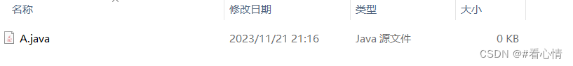

1. 使用记事本打开，输入：

```
public class A{
    public static void main(String[] args){
         System.out.println("Hello World");
    }
}
```

注意：java 中的代码是严格区分大小写

java 中的标点符号必须是英文状态下输入，不能是中文状态

java 中的路径，文件名都不要使用中文

1. 在文件夹上目录上输入 cmd 回车

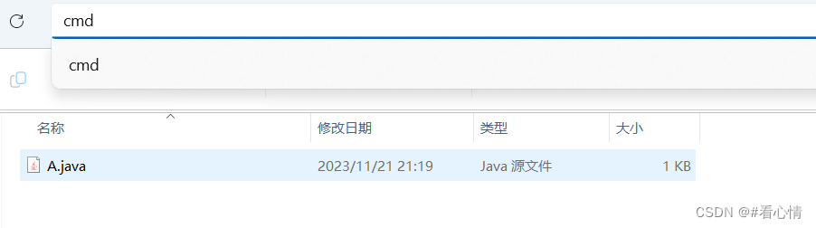

1. 输入 javac A.java 编译 Java 文件

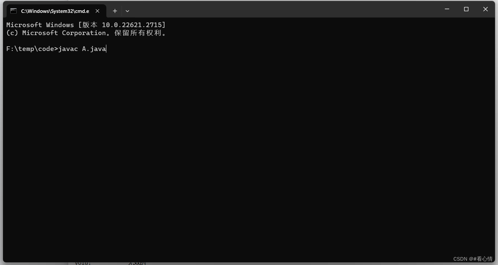

1. 编译完后会产生一个 A.class 文件

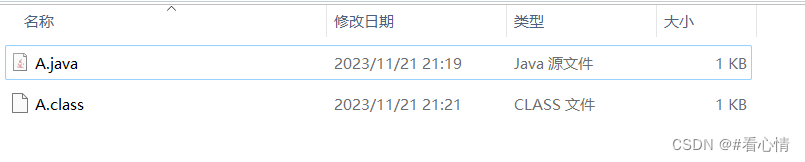

1. 输入 java A 运行 Java 文件

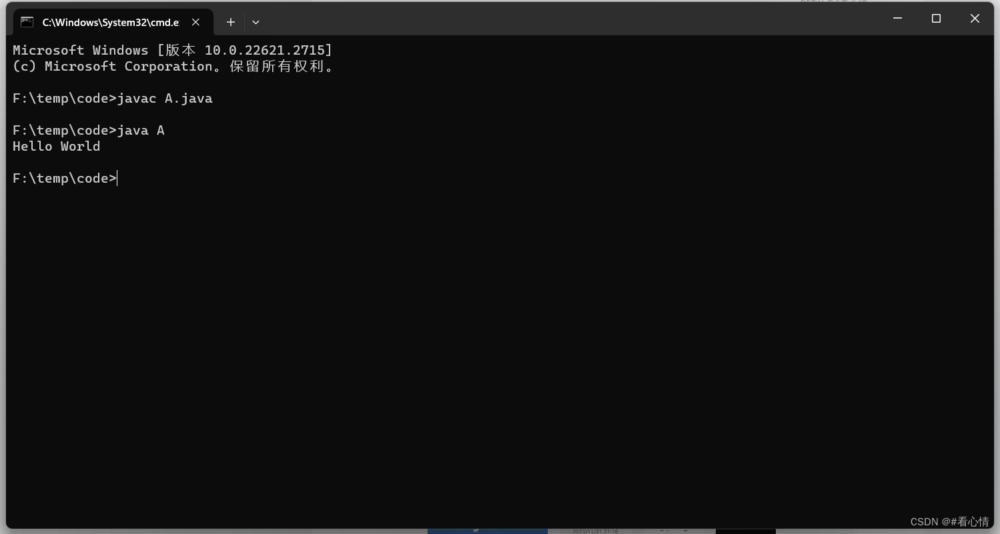

编译：A.java -> jdk -> A.class

运行：A.class

[Java 开发工具 IDEA 安装（2023）-CSDN 博客](https://blog.csdn.net/qq_63519395/article/details/134449953?spm=1001.2014.3001.5501) [CSDN](https://mp.csdn.net/mp_blog/creation/editor/134450743)

## 四、Java 中的注释

1. 单行注释：//
2. 多行注释：/* */
3. 文档注释:：/** **/

## 五、数据类型

### Java 基本数据类型

注意：String 是对象，不属于 8 大基本数据类型！！！

### 数据类型转换

1. 自动转换 (隐式转换)：小范围 -> 大范围

```
// 将 int 转换成 double (小范围 -> 大范围)
int a = 10;
double b = a;  // 10.00
```

1. 强制转换 (显示转换): 大范围 -> 小范围

```
// 将 double 转换成 int (大范围 -> 小范围)
double a = 11.11;
int b = (int) a;    // 11
```

## 五、变量

### 为什么要使用变量？

1. 存储数据：变量用于存储数据，可以是数字、文本、布尔值等。通过给变量赋值，我们可以在程序中保存和操作数据。
2. 数据共享：变量允许我们在程序中共享数据。通过将数据存储在变量中，我们可以在不同的代码块中访问和使用相同的数据。
3. 数据处理：变量使得数据处理更加灵活和方便。我们可以对变量进行计算、操作和转换，从而实现各种功能和逻辑。
4. 代码可读性：使用变量可以增加代码的可读性和可维护性。通过给变量取一个有意义的名称，可以更清晰地表达代码的意图，使代码更易于理解和修改。
5. 代码重用：通过使用变量，我们可以在不同的地方重复使用相同的数据。这样可以减少代码的冗余，提高代码的复用性和效率。

### 什么是变量？

变量是计算机程序中用于存储数据的一种数据类型。它是一个名称，代表了一个值或一个对象，可以在程序中多次使用。在程序中，我们可以给变量赋值，修改变量的值，以及使用变量来进行各种计算和操作。

### 声明变量的三要素

1. 变量名：用于标识变量的名称，必须符合一定的命名规则。
2. 变量类型：用于指定变量的数据类型，例如整数、浮点数、布尔值、字符串等。
3. 变量值：存储在变量中的具体数值或对象。

### 声明变量的四种方式

```
/*
  第一种: 声明变量并且赋值
         变量类型 变量名 = 值;
*/
int a = 10;

/*
  第二种: 先声明变量，再赋值
         变量类型 变量名;
         变量名 = 值;
*/
int b;
b = 10;

/*
  第三种: 同一种类型的变量，一行声明多个
         变量类型 变量名1,变量名2,变量名3;
         变量名1 = 值;
         变量名2 = 值;
         变量名3 = 值;
*/
int c1, c2, c3;
c1 = 10;
c2 = 20;
c3 = 30;

/*
  第四种: 同一种类型的变量，一行声明多个并且赋值
          变量类型 变量名1 = 值1, 变量名2 = 值2, 变量名3 = 值3;
*/
int d1 = 1, d2 = 2, d3 = 3;
```

### 变量交换

```
int a = 10;
int b = 20;
int c = a;  // 将 a 的值赋值给 c
a = b; // 将 b 的值赋值给 a (原值会覆盖)
b = c; // 将 c (原 a 的值) 赋值给 b

System.out.println("a: " + a + ", b: " + b);  // a: 20, b: 10
```

### 变量命名规则

1. 首字母: 字母, _, $, 中文 (不推荐使用)
2. 首字母后面: 首字母, 数字, 也可以没有
    
    注意: 不能是 java 中的关键字
    

## 六、运算符

### 1. 算术运算符

### 加法 (+)

```
int a = 10, b = 20;
System.out.println(a + b);  // 10 + 20 = 30

// 如果一个数字加一个字符串,则会进行拼接
int c = 123;
String d = "hello";
System.out.println(c + d);  // 123 + hello = 123hello
```

### 减法 (-)

```
int a = 20, b = 10;
System.out.println(a - b); // 20 - 10 = 10
```

### 乘法 (*)

```
int a = 2, b = 5;
System.out.println(a * b); // 2 * 5 = 10
```

### 除法 (/)

```
int a = 10;
int b = 2;
System.out.println(a / b); // 5

int c = 5;
int d = 2;
System.out.println(c / d); // 2
```

### 取模 (%)

```
int a = 5;
int b = 2;
System.out.println(a % b); // 1

int c = 6;
int d = 2;
System.out.println(c % d); // 0
```

### 递增 (++)

```
// 第一种先加在赋值
int a = 1;
System.out.println(++a); // 2;

// 第二种先赋值在加
int b = 1;
System.out.println(b++); // 1
```

### 递减 (--)

```
// 第一种先减在赋值
int a = 1;
System.out.println(--a); // 0;

// 第二种先赋值在减
int b = 1;
System.out.println(b--); // 1
```

### 2. 赋值运算符

### 赋值 (=)

```
// 给 a 和 b 同时赋值
int a = 10, b = 20;
System.out.println("a: " + a + ", b: " + b);  // a: 10, b: 20

// 字符串类型也可以进行 加法赋值
String a = "hello", b = " world";
a += b;
System.out.println(a);  // hello world
```

### 加法赋值 (+=)

```
// 将第一个数字加与第二个数字
int a = 10, b = 20;
a+=b;
System.out.println(a); // 30
```

### 减法赋值 (-=)

```
// 将第一个数字减与第二个数字
int a = 10, b = 20;
a-=b;
System.out.println(a); // -10
```

### 乘法赋值 (*=)

```
// 将第一个数字乘与第二个数字
int a = 10, b = 20;
a*=b;
System.out.println(a); // 200
```

### 除法赋值 (/=)

```
// 将第一个数字除与第二个数字
int a = 100, b = 20;
a/=b;
System.out.println(a); // 5
```

### 取模赋值 (%=)

```
// 将第一个数字模与第二个数字
int a = 5, b = 2;
a%=b;
System.out.println(a); // 1
```

### 3. 比较运算符

比较运算返回的结果是一个 boolean 值不是 true 就是 false;

### 等于 (==)

```
// 比较两个数是否相等
int a = 5, b = 2;
System.out.println(a==b); // false

// 比较两个字符串是否相等
String a = "hello", b = "hello";
System.out.println(a==b); // true
```

### 不等于 (!=)

```
// 比较第一个数是否不等于第二个数
int a = 5, b = 2;
System.out.println(a!=b); // true

// 比较第一个字符串是否不等于第二个字符串
String a = "hello", b = "hello";
System.out.println(a!=b); // false
```

### 大于 (>)

```
// 比较第一个数是否大于第二个数
int a = 5, b = 2;
System.out.println(a>b); // true
```

### 小于 (<)

```
// 比较第一个数是否小于第二个数
int a = 5, b = 2;
System.out.println(a<b); // false
```

### 大于等于 (>=)

```
// 比较第一个数是否大于或者等于第二个数
int a = 5, b = 2;
System.out.println(a>=b); // true
```

### 小于等于 (<=)

```
// 比较第一个数是否小于或者等于第二个数
int a = 5, b = 2;
System.out.println(a<=b); // false
```

### 4. 逻辑运算符

逻辑运算的前提是需要两个表达式，返回的是 boolean 值。

### 与 (&&)

两个表达式同时为 true 时返回 true，否则返回 false

```
// 判断a 等于 b 并且 c 等于 d
int a = 5, b = 2;
int c = 10, d = 10;
System.out.println(a == b && c == d); // false
```

### 或 (||)

有一个表达式为 true 时返回 true，两个表达式都为 false 返回 false

```
// 判断 a 等于 b  或者 c 等于 d
int a = 5, b = 2;
int c = 10, d = 10;
System.out.println(a == b || c == d); // true
```

### 非 (!)

```
// 取反
boolean b = true;
System.out.println(!b); // false

// 结合表达式使用
int a = 10, b = 10;
System.out.println(!(a == b)); // false
```

### 5. 位运算符

### 按位与 (&)

将两个操作数的对应位进行按位与操作，只有在对应位都为 1 时，结果位才为 1。

```
int a = 5; // 二进制表示为 0101
int b = 3; // 二进制表示为 0011
int result = a & b; // 二进制结果为 0001，即 1
System.out.println(result);  // 1
```

### 按位或 (|)

将两个操作数的对应位进行按位或操作，只要对应位中有一个为 1，结果位就为 1。

```
int a = 5; // 二进制表示为 0101
int b = 3; // 二进制表示为 0011
int result = a | b; // 二进制结果为 0111，即 7
System.out.println(result);   // 7
```

### 按位异 (^)

将两个操作数的对应位进行按位异或操作，当对应位不同时，结果位为 1；当对应位相同时，结果位为 0。

```
int a = 5; // 二进制表示为 0101
int b = 3; // 二进制表示为 0011
int result = a ^ b; // 二进制结果为 0110，即 6
System.out.println(result);  // 6
```

### 取反 (~)

对操作数进行按位取反操作，将 0 变为 1，将 1 变为 0。取反操作是针对二进制补码表示的。

```
int a = 5; // 二进制表示为 0000 0000 0000 0000 0000 0000 0000 0101
int result = ~a; // 二进制结果为 1111 1111 1111 1111 1111 1111 1111 1010，即 -6
System.out.println(result);  // -6
```

### 左移 (<<)

将操作数的所有位向左移动指定的位数，右侧用 0 填充。

```
int a = 5; // 二进制表示为 0000 0000 0000 0000 0000 0000 0000 0101
int result = a << 2; // 二进制结果为 0000 0000 0000 0000 0000 0000 0001 0100，即 20
System.out.println(result); // 20
```

### 右移 (>>)

将操作数的所有位向右移动指定的位数，左侧用原有的最高位填充（保持符号位不变）。

```
int a = -10; // 二进制表示为 1111 1111 1111 1111 1111 1111 1111 0110
int result = a >> 2; // 二进制结果为 1111 1111 1111 1111 1111 1111 1111 1101，即 -3
System.out.println(result); // -3
```

### 6. 三元运算符

根据条件选择不同类型的值相当于 if-else，形式为：条件 ? 值 1 : 值 2

```
int a = 10, b = 5;
String result = a > b ? "a 大于 b":"a 小于 b";
System.out.println(result); // a 大于 b
```

### 7. instanceof 运算符

`instanceof` 运算符用于检查一个对象是否属于某个类或其子类的实例

```
// 动物类
class Animal{

}

// 狗类 继承 动物类
class Dog extends Animal{

}

public class Test {

    public static void main(String[] args) {

        // Dog 是 Animal 的子类，所以返回 true
        System.out.println(new Dog() instanceof Animal); // true

        // Animal 不是 Dog 的子类，所以返回 false
        System.out.println(new Animal() instanceof Dog);  // false
    }

}
```

### 8. 运算符优先级

从高到低

1. 一元运算符（如 ++、--、+、-、!）
2. 乘法和除法（*、/、%）
3. 加法和减法（+、-）
4. 移位运算符（<<、>>、>>>）
5. 比较运算符（<、<=、>、>=、instanceof）
6. 相等运算符（==、!=）
7. 位与（&）
8. 位异或（^）
9. 位或（|）
10. 逻辑与（&&）
11. 逻辑或（||）
12. 条件运算符（? :）
13. 赋值运算符（=、+=、-=、*=、/= 等）

## 七、条件判断 if-else

If-else 语句是 Java 中用于根据条件执行代码的一种结构。它由一个条件、一个 then 子句和一个 else 子句组成。条件是一个布尔表达式，它可以是 true 或 false。如果条件为 true，则执行 then 子句。如果条件为 false，则执行 else 子句。

```
/* 第一种 if 单独使用
 if(条件){
    条件满足执行
 }
 */
if (i > 100) {
    System.out.println("i 大于 100 时执行");
}

/* 第二种 if else 结合使用
 if(条件){
    条件满足执行
 }else{
    条件不满足执行
 }
 */
if (i > 100) {
    System.out.println("i 大于 100 时执行");
} else {
    System.out.println("i 小于 100 时执行");
}

// 简写 省略大括号
if (i > 100)
    System.out.println("i 大于 100 时执行");
 else
    System.out.println("i 小于 100 时执行");

 // 简写 使用三元运算符
String str = (i > 100) ? "i 大于 100 时执行":"i 小于 100 时执行";
System.out.println(str);

/* 第三种 多重if
if(条件1){
    满足条件1执行
} else if(条件2){
    满足条件2执行
} else if(条件3){
    满足条件3执行
}else{
    都不满足执行
}
 */
if (i > 10) {
    System.out.println("i 大于 10");
} else if (i < 10) {
    System.out.println("i 小于 10");
} else {
    System.out.println("i 等于 10");
}

/* 第四种 嵌套if
if(条件1){
    if(条件2){
        满足条件1，满足条件2执行
    }else{
       满足条件1，不满足条件2执行
    }
} else {
    if(条件3){
        不满足条件1，满足条件3执行
    }else{
        不满足条件1，不满足条件3执行
    }
}
 */
if (i >= 100) {
    if (i >= 120) {
        System.out.println("i 大于等于 120 执行");
    } else {
        System.out.println("i 大于等于 100 小于 120 执行");
    }
} else {
    if (i >= 80) {
        System.out.println("i 在执行");
    } else {
        System.out.println("i 小于 80 执行");
    }
}
```

## 八、switch

switch 语句是根据一个表达式的值执行不同的代码块的一种结构。switch 语句由一个关键字 switch、一个表达式和一个或多个 case 语句组成。表达式必须是一个整数、字符或字符串。case 语句由一个关键字 case 和一个常量组成。每个 case 语句后面跟着一个冒号，然后是该 case 语句要执行的代码块。

```
// 猜拳游戏: 1-石头，2-剪刀，3-布
int i = 1;
String str;
switch (i) {
    case 1:
        str = "石头";
        break;
    case 2:
        str = "剪刀";
        break;
    case 3:
        str = "布";
        break;
    default:
        str = "其他";
        break;
}

System.out.println("你出的是：" + str);

// 简写
String str = switch (i) {
    case 1 -> "石头";
    case 2 -> "剪刀";
    case 3 -> "布";
    default -> "其他";
};
```

## 九、Scanner 和 Random 的使用

### 1. 扫描器 scanner

```
// 创建一个 Scanner 对象
Scanner scanner = new Scanner(System.in);

// 接受用户输入的整数
System.out.println("输入一个整数");
int i = scanner.nextInt();
System.out.println("输入的整数为：" + i);

// 接受用户输入的字符
System.out.println("输入一个字符串");
String str = scanner.next();
System.out.println("输入的字符串为："+str);
```

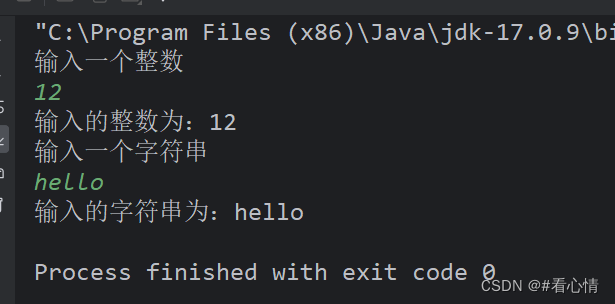

### 2. 随机数 random

```
// 创建一个 Random 对象
Random random = new Random();

// 生成一个随机数
int i = random.nextInt();

System.out.println("生成的数为: " + i);
```

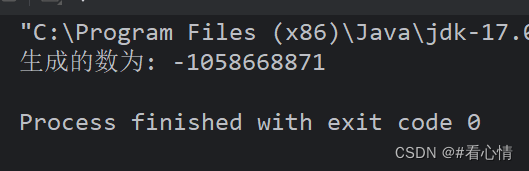

生成指定范围的随机数

```
// 创建一个 Random 对象
Random random = new Random();

// 生成 25-55之间的随机数，公式：(最大值-最小值+1) + 最小值
int i = random.nextInt(31) + 25;
System.out.println("生成数为：" + i);
```

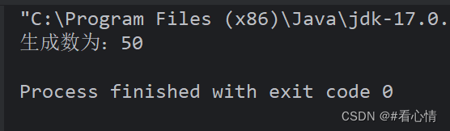

## 十、循环

### 1. while 循环

循环 3 要素

1. 变量初始化
2. 循环的条件
3. 变量改变

语法：

```
变量初始化
while(循环的条件){
    循环体(变量改变)
}
```

示例：

```
// 打印1-10
int i = 0;          // 变量初始化
while (i < 10) {    // 循环条件
    i++;            // 变量改变
    System.out.println(i);
}
```

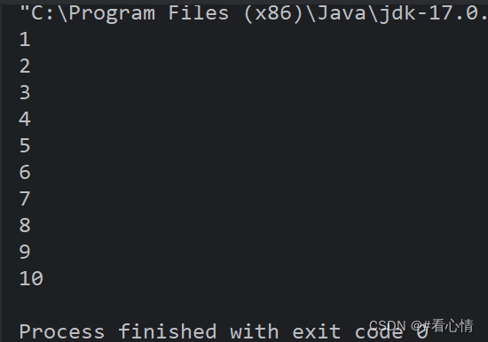

### 2. do...while 循环

语法：

```
变量初始化
do{
   循环体(变量改变)
}while(循环的条件);
```

示例：

```
// 打印1-10
int i = 0;          // 变量初始化
do {
    i++;            // 变量改变
    System.out.println("do...while 循环打印：" + i);
}while (i < 10);    // 循环条件
```

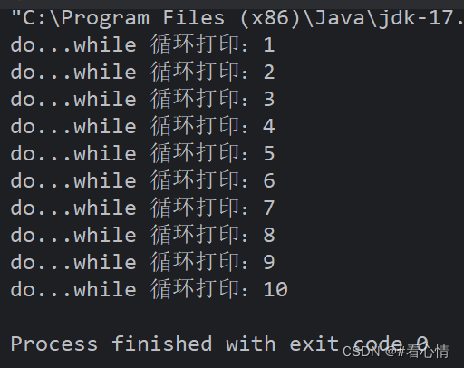

### 3. for 循环

语法：

```
for(变量初始化; 循环条件;  变量改变){
     循环体
}
```

示例：

```
// 打印1-10
for (int i = 1; i <= 10; i++) {
    System.out.println("for 循环打印：" + i);
}
```

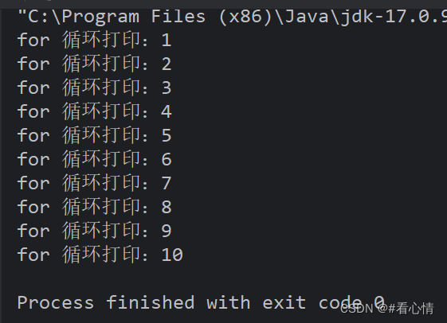

### 4. 循环使用场景

1. 知道具体的循环次数，优先使用 for 循环
- while 是先判断循环条件，在执行循环体
    1. do...while 是执行一次的循环体，在判断循环条件
    - o...while 至少会执行一次

### 5. 循环嵌套

```
// 打印九九乘法表
for (int i = 1; i <= 9; i++) {
    for (int j = 1; j <= i; j++) {
        System.out.print(i + "X" + j + "= " + i * j + "\t");
    }
    System.out.println();
}
```

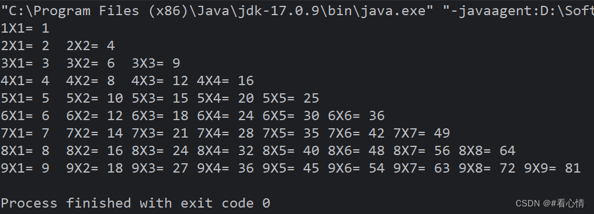

### 6. 跳出 break

终止当前循环

```
// 如果输出的数为 4 则终止循环
for (int i = 0; i < 10; i++) {
    if(i == 4){
        break;
    }
    System.out.println(i);
}
```

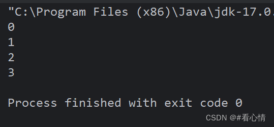

### 7. 继续 continue

终止当次循环，进入下一次循环

```
// 跳过 4
for (int i = 0; i < 10; i++) {
    if(i == 4){
        continue;
    }
    System.out.println(i);
}
```

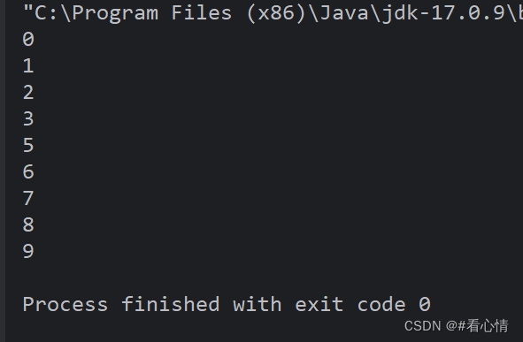

### 8. 返回 return

终止所有循环，直接返回

```
// 如果输出的数为4终止所有循环
for (int i = 0; i < 10; i++) {
    if(i == 4){
        return;
    }
    System.out.println(i);
}
```

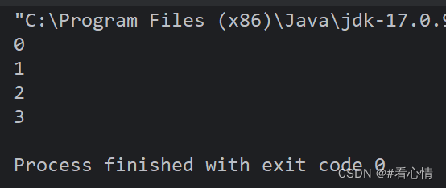