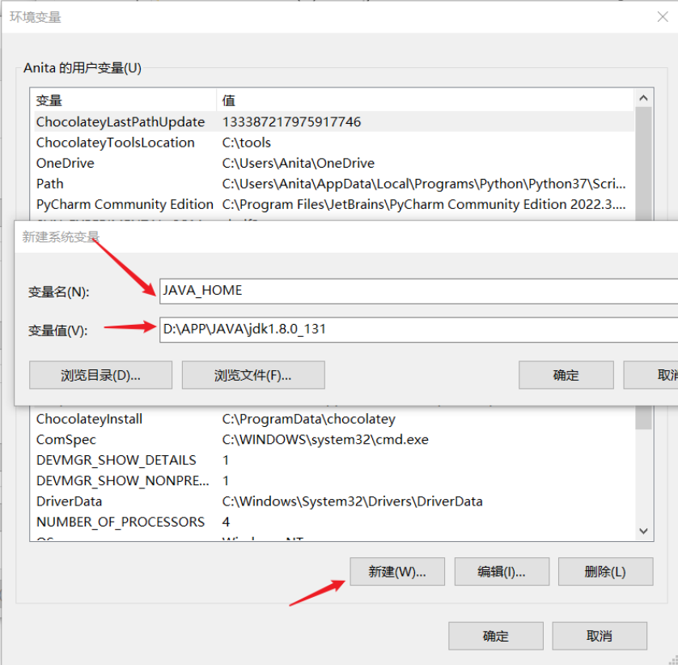

# 环境变量

安装目录：D:\APP\JAVA\jdk1.8.0_131

## Java根目录
JAVA_HOME环境变量



## Java命令
bin 环境变量


## Jre命令
jre环境变量


## 检验

```java
PS C:\Users\Anita> java -version
java version "1.8.0_131"
Java(TM) SE Runtime Environment (build 1.8.0_131-b11)
Java HotSpot(TM) 64-Bit Server VM (build 25.131-b11, mixed mode)
```

